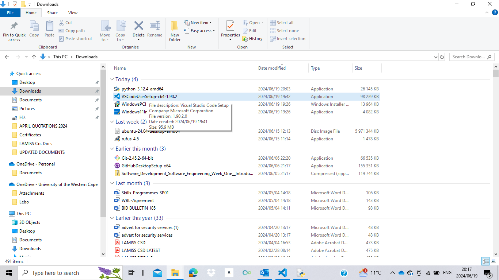
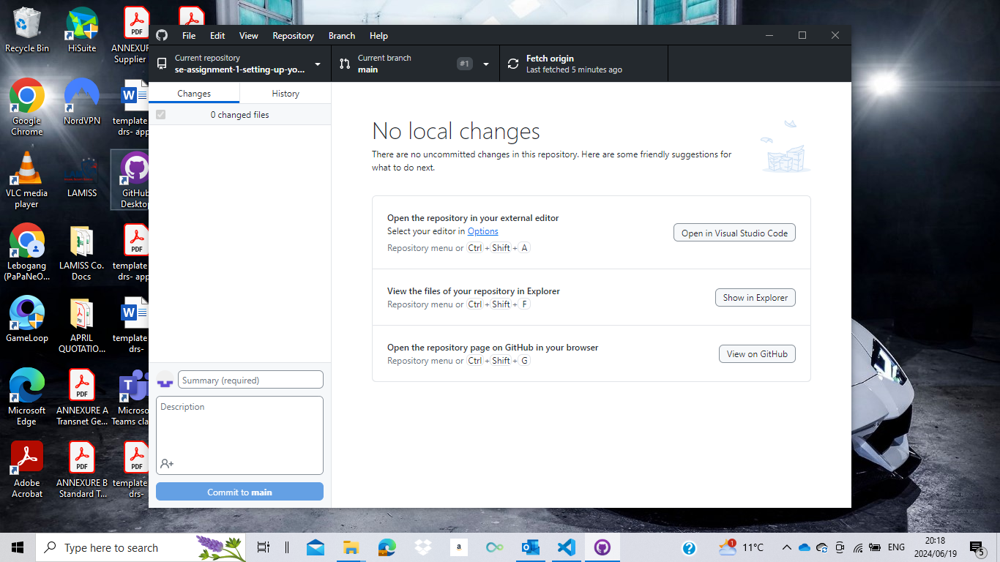

# Dev_Setup
Setup Development Environment

#Assignment: Setting Up Your Developer Environment

#Objective:
This assignment aims to familiarize you with the tools and configurations necessary to set up an efficient developer environment for software engineering projects. Completing this assignment will give you the skills required to set up a robust and productive workspace conducive to coding, debugging, version control, and collaboration.

#Tasks:

1.Select Your Operating System (OS):
   Choose an operating system that best suits your preferences and project requirements. Download and Install Windows 11. https://www.microsoft.com/software-download/windows11
Ans: 
Operating System: Microsoft Windows

How to Download and Install Windows 11
i.My PC is Windows 11 Pro,and here is how to download and install Windows 11.
11.Visit: https://www.microsoft.com/software-download/windows11
iii.Upon opening the link this is the instruction; - Before installing, please refer to the PC Health Check app to confirm your device meets the minimum system requirements for
Windows 11 and check the Windows release information status for known issues that may affect your device.
iv. If you don't have PC Health Check installed, you can install it by going to https://aka.ms/GetPCHealthCheckApp 
v.Download.

2. Install a Text Editor or Integrated Development Environment (IDE):
   Select and install a text editor or IDE suitable for your programming languages and workflow. Download and Install Visual Studio Code. https://code.visualstudio.com/Download
   Ans:
   How to download and install Visual Studio Code
   a. Go to: https://code.visualstudio.com/Download
   b. Click on the download option for Windows.
   c. Once the installer is downloaded, locate the downloaded file.
   d. Double-click on the installer file to run it.
   e. Click on "Yes" to confirm and proceed the installation.
   f. Review the license agreement and click on "I accept the agreement" to proceed.
   g. Click on the "Next" button to proceed with the installation.
   h. Create a desktop shortcut or adding VS Code to the PATH environment variable.
   i. Click on the "Next" button to start the installation process.
   j. Once the installation is complete, click on the "Finish" button to exit the setup wizard.
   h. After the installation is complete, you can launch Visual Studio Code by double-clicking its icon on the desktop or searching for "Visual Studio Code" in the Start menu.
   

   How to Install
3. Set Up Version Control System:
   Install Git and configure it on your local machine. Create a GitHub account for hosting your repositories. Initialize a Git repository for your project and make your first commit. https://github.com
Ans:
a. Installing Git

i. Visit https://git-scm.com/download/win 
ii. Click to download the latest (2.45.2) 64-bit version of Git for my Windows.
iii.Install Git
iv. In the installer window,click on "Run" to proceed. 
v. Follow the on-screen instructions,by not changing anything and clicking on next button till you get to the install button then click on it to install Git.
vi. Tick on the Launch Git Bash.
vii. Click finish to complete the Git setup wizard

b.Configuring Git in my local machine
i. Open Git bash or a terminal.
<!-- Type this command: git --version (to check the Git version, in my case it has rendered: git version 2.45.2.windows.1) -->
ii. Type this command: git --config user.name "Dineo zitha"
iii. git --config user.email 
 
c. Creating a Github Account
i. Visit https://github.com/ and sign up for a new account.

d. Initializing a Git Repository
i. Create a new directory for your project 

4. Install Necessary Programming Languages and Runtimes:
  Instal Python from http://wwww.python.org programming language required for your project and install their respective compilers, interpreters, or runtimes. Ensure you have the necessary tools to build and execute your code.
  Ans:
  Installing Python
  i. Go to the official Python website: https://www.python.org/downloads/
  ii. Download the latest version of python. For my case its python 3.12.4.
  iii. Find the installation file and click on it to download.
  iv. Save the file to local disk C.
  v. Double-click to run the Python download file.

5. Install Package Managers:
   If applicable, install package managers like pip (Python).
   i. To install pip, you will need to have Python installed on your system.For my case, I already have python installed in my PC.
   ii. You can check if you have Python by typing `python --version` in your terminal or command prompt. Mine is python 3.12.3
   iii. 

6. Configure a Database (MySQL):
   Download and install MySQL database. https://dev.mysql.com/downloads/windows/installer/5.7.html
   Ans:
   How to download and install MySQL database
   i. Open your browser and click on a new tab.
   ii. Type mysql community downloads and press enter, alternatively copy and paste this link: https://dev.mysql.com/downloads/windows/installer/5.7.html
   iii. Once the link has opened up, ensure it has Oracle logo at the bottom of the page.  
   iv. Select version 8.0.37
   v. Operating system is windows so, I'll not change anything.
   vi. To download, click on the second link that has Windows (x86, 32-bit), MSI Installer	8.0.37	296.1M	and click on the download button against it then click on "No thanks, just start my download."
   vii. After downloading, unzip it, and double click.
   viii. Choose "Full" setup type. This installs all MySQL products and features. Then click the "Next" button to continue.
   ix. Click "Execute" to download and install the Products. After finishing the installation, click "Next".
   x. Select Custom
   xi. Check Requirements" screen: Dont change anything, click "Next".
   xii. Installation" screen: See what products that will be installed. Click "Execute" to download and install the Products. After finishing the installation, click "Next".
   xiii. "Product Configuration" screen: See what products that will be configured. Click the "MySQL Server 8.0.37" option to configure the MySQL Server. Click the "Next" button. Choose the "Standalone MySQL Server/Classic MySQL Replication" option and click on the "Next" button. In page  "Type and Networking" set Config Type to "Development Computer" and "Connectivity" to "TCP/IP" and "Port" to "3006". Then, click the "Next" button.
   xiv. Authentication Method" screen: Choose "Use Strong Password Encryption for Authentication". Create a password you'll remember. Click "Next".
   xv.Accounts and Roles" screen: Set a password for the root account. Click "Next".
   xvi. Windows Service" screen: Here, you configure the Windows Service to start the server. Keep the default setup, then click "Next
   xvii. Apply Configuration" screen: Click the "Execute" button to apply the Server configuration. After finishing, click the "Finish" button.
   xviii. Product Configuration" screen: See that the Product Configuration is completed. Keep the default setting and click on the "Next" and "Finish" button to complete the MySQL package installation.
   xix.Click on "Next", "Finish" and then click the "Next" button.

7. Set Up Development Environments and Virtualization (Optional):
   Consider using virtualization tools like Docker or virtual machines to isolate project dependencies and ensure consistent environments across different machines.

8. Explore Extensions and Plugins:
   Explore available extensions, plugins, and add-ons for your chosen text editor or IDE to enhance functionality, such as syntax highlighting, linting, code formatting, and version control integration.
